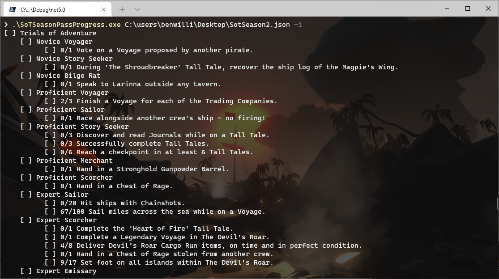

# Sea of Thieves Season Pass Progress parser

I was looking for a simpler way to view my Season progress in Sea of Thieves than popping in and out of all the categories in the menus. This is the quick result.

Your season progress can be found at https://www.seaofthieves.com/profile/seasons. In the background, this authenticated page downloads your progress from https://www.seaofthieves.com/api/profilev2/seasons-progress. You can use Fiddler or the browser's F12 tools to save this to a file. This app will parse it and display the progress in a more compact form.

To run this file just call it with the json filepath
```
SoTSeasonPassProgress.exe SotSeason2Progress.json
```
You will get an output like this


if you add the -i option you will only get the incomplete goals


###### (and yes that's Fetcher's Rest as the background of my terminal.  #BeMorePirate 🏴‍☠️)

###### ((this is a totally unofficial personal project and is not approved by or associated with Rare or Xbox Games Studio))
